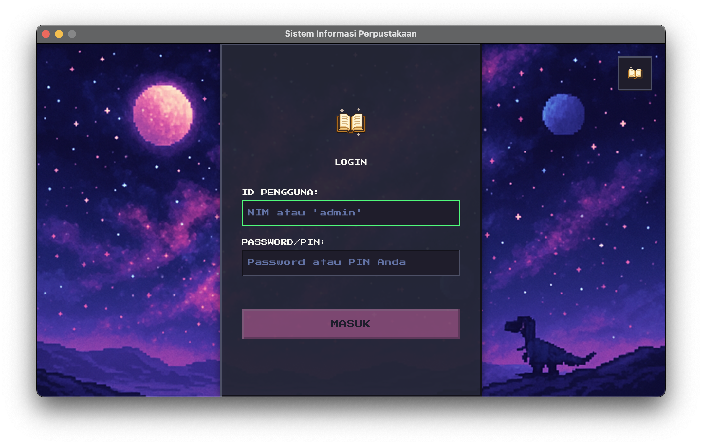

# Sistem Informasi Perpustakaan (Desktop)


## Deskripsi Proyek

Aplikasi ini adalah sistem manajemen perpustakaan (Library Management System/LMS) berbasis desktop yang dibangun menggunakan Java dan JavaFX. Sistem ini dirancang untuk mendukung operasi harian perpustakaan seperti manajemen koleksi buku, data anggota, dan transaksi peminjaman/pengembalian, serta menyediakan antarmuka khusus untuk peran Admin dan Mahasiswa.



## Tujuan Proyek

- Meningkatkan efisiensi pengelolaan perpustakaan dengan sistem digital.
- Memberikan pengalaman pengguna yang intuitif dan informatif.
- Menyediakan visualisasi data dan fitur pelaporan untuk pengambilan keputusan.

---

## Fitur Utama

### Untuk Admin

- **Dashboard "Pusat Komando"**: Ringkasan aktivitas terbaru & status keterlambatan buku secara _real-time_.
- **Manajemen Buku**: CRUD lengkap untuk katalog buku dalam format "Rak Buku Virtual".
- **Manajemen Anggota**: CRUD lengkap dengan pencarian real-time dan visualisasi berdasarkan gender.
- **Proses Pengembalian**: Menampilkan denda secara otomatis dalam panel kontekstual.
- **Laporan & Analisis**: "Activity Feed" dengan filter tanggal, tipe transaksi, dan pencarian teks.

### Untuk Mahasiswa

- **Login Otomatis Berdasarkan Peran**.
- **Dashboard Pribadi**: Menampilkan buku yang sedang dipinjam dan rekomendasi populer.
- **Katalog Buku Interaktif**: Fitur pencarian, sortir, dan filter.
- **Proses Peminjaman Dinamis**: Pilih durasi, lihat estimasi jatuh tempo secara langsung.
- **Manajemen Profil**: Edit informasi kontak & PIN.
- **Validasi Pinjaman Otomatis**: Sistem mencegah peminjaman jika batas maksimal tercapai.

---

## Tumpukan Teknologi

| Kategori           | Teknologi                   |
| ------------------ | --------------------------- |
| Bahasa Pemrograman | Java 17+                    |
| Framework UI       | JavaFX 21                   |
| Build & Dependensi | Apache Maven                |
| Penyimpanan Data   | File `.csv` melalui OpenCSV |
| Ikonografi         | FontAwesomeFX               |

---

## Struktur Proyek

```
📁 NAMA_PROYEK/
├── data/                     # File CSV (books, members, transactions)
├── src/
│   └── main/
│       ├── java/
│       │   └── com/perpustakaan/
│       │       ├── controller/     # Logika kontrol halaman
│       │       ├── dao/            # Data Access Object (interaksi file CSV)
│       │       ├── model/          # POJO (Book, Member, dll)
│       │       └── App.java        # Entry point aplikasi
│       └── resources/
│           ├── com/perpustakaan/view/
│           │   ├── *.fxml          # Tampilan UI
│           │   ├── base.css
│           │   ├── theme-login.css
│           │   └── theme-dashboard.css
│           ├── fonts/
│           └── images/
└── pom.xml
```

### `data/`

Berisi:

- `books.csv`: database koleksi buku
- `members.csv`: database data mahasiswa/anggota
- `transactions.csv`: riwayat transaksi peminjaman & pengembalian

Format `.csv` ini digunakan sebagai alternatif ringan pengganti database relasional. Operasi baca-tulis dilakukan via **OpenCSV**.

---

### `src/main/java/com/perpustakaan/`

#### `controller/`

Berisi kelas-kelas _controller_ JavaFX (annotasi `@FXML`) yang mengatur interaksi antara antarmuka pengguna (FXML) dan logika program. Contoh:

- `LoginController.java`
- `DashboardAdminController.java`
- `PeminjamanController.java`

#### `dao/`

Berisi _Data Access Object_, yaitu kelas-kelas yang menangani akses ke data `.csv`:

- `BookDAO.java`
- `MemberDAO.java`
- `TransactionDAO.java`

Masing-masing DAO bertanggung jawab atas:

- Membaca dan menulis data
- Melakukan pencarian, filter, dan modifikasi

#### `model/`

Berisi _Plain Old Java Objects (POJO)_ yang mewakili entitas data:

- `Book.java`: Properti seperti `id`, `judul`, `penulis`, `status`
- `Member.java`: Properti seperti `nim`, `nama`, `jenisKelamin`, dll
- `Transaction.java`: Properti seperti `id`, `nim`, `isbn`, `tanggalPinjam`, `tanggalKembali`

Digunakan sebagai struktur data internal aplikasi.

#### `App.java`

Merupakan **entry point** utama aplikasi. Menjalankan JavaFX Application dan memuat halaman login:

```java
public class App extends Application {
    @Override
    public void start(Stage primaryStage) throws IOException {
        Parent root = FXMLLoader.load(getClass().getResource("/com/perpustakaan/view/LoginView.fxml"));
        ...
    }
}
```

---

### `src/main/resources/com/perpustakaan/view/`

#### `*.fxml`

Berisi **desain antarmuka UI** menggunakan FXML (XML untuk JavaFX). Setiap halaman memiliki file FXML masing-masing:

- `Login.fxml`
- `DashboardAdmin.fxml`
- `Katalog.fxml`
- `Profile.fxml`
- `Pengembalian.fxml`

FXML ini dikaitkan langsung dengan controller yang sesuai.

#### CSS

- `base.css`: gaya umum aplikasi
- `theme-login.css`: gaya khusus halaman login
- `theme-dashboard.css`: tema visual dashboard admin dan mahasiswa

JavaFX mendukung pengaturan gaya layaknya CSS di web.

---

### `fonts/`

- Berisi file `.ttf` seperti `PressStart2P-Regular.ttf`
- Font ini digunakan secara eksplisit di UI untuk memberikan nuansa visual yang unik dan retro-modern.

---

### `images/`

- Berisi ikon UI (format `.png`) yang digunakan di berbagai halaman aplikasi
- Contoh: ikon buku, pengguna, pinjaman, kembali, dll

---

### `pom.xml`

File konfigurasi **Apache Maven**, yang mendeklarasikan:

- Versi Java
- Plugin JavaFX
- Dependency seperti:

  - `com.opencsv:opencsv`
  - `de.jensd:fontawesomefx`

- Plugin untuk menjalankan aplikasi (`javafx-maven-plugin`)

Contoh bagian penting:

```xml
<properties>
    <project.build.sourceEncoding>UTF-8</project.build.sourceEncoding>
    <maven.compiler.source>24</maven.compiler.source>
    <maven.compiler.target>24</maven.compiler.target>
    <javafx.version>21</javafx.version>
    <javafx.maven.plugin.version>0.0.8</javafx.maven.plugin.version>
    <exec.mainClass>com.perpustakaan.App</exec.mainClass>
</properties>
```

---

## Instalasi & Penyiapan

Tentu! Berikut adalah penjabaran ulang bagian **Instalasi & Penyiapan** yang lebih teknis dan lengkap, termasuk petunjuk menginstal Apache Maven:

---

## Instalasi & Penyiapan

### 1. **Pastikan Prasyarat Sudah Terinstal**

#### Java JDK 17 atau lebih baru

- **Cek versi Java:**

  ```bash
  java -version
  ```

  Output yang diharapkan:

  ```
  java version "17.0.x"
  ```

- Jika belum ada, unduh dan instal dari [https://jdk.java.net/17/](https://jdk.java.net/17/) atau gunakan SDK Manager seperti [SDKMAN](https://sdkman.io/).

#### Apache Maven

Apache Maven digunakan untuk membangun proyek dan menjalankan aplikasi JavaFX.

##### Cara Instal Maven:

- **Linux/macOS (dengan Homebrew atau SDKMAN):**

  ```bash
  brew install maven        # Jika menggunakan Homebrew
  sdk install maven         # Jika menggunakan SDKMAN
  ```

- **Windows:**

  1. Unduh dari: [https://maven.apache.org/download.cgi](https://maven.apache.org/download.cgi)
  2. Ekstrak ke direktori, misalnya: `C:\Program Files\Apache\Maven`
  3. Tambahkan variabel lingkungan:

     - `MAVEN_HOME`: arahkan ke folder Maven
     - Tambahkan `%MAVEN_HOME%\bin` ke `PATH`

- **Verifikasi Instalasi:**

  ```bash
  mvn -v
  ```

  Output yang diharapkan:

  ```
  Apache Maven 3.x.x
  Java version: 17
  ```

---

### 2. **Buat Folder dan File Data**

Di direktori root proyek (`perpus/`), buat folder dan file berikut:

```bash
mkdir data
touch data/books.csv data/members.csv data/transactions.csv
```

Isi setiap file minimal dengan **baris header** sesuai struktur:

**Contoh `books.csv`:**

```
id,judul,penulis,tahun,kategori,status
```

**Contoh `members.csv`:**

```
nim,nama,jenisKelamin,email,alamat,noTelepon,pin
```

**Contoh `transactions.csv`:**

```
id,nim,isbn,tanggalPinjam,tanggalKembali,status,denda
```

---

### 3. **Instalasi Dependensi**

Jalankan perintah berikut di terminal (pastikan di dalam folder proyek):

```bash
mvn clean install
```

Perintah ini akan:

- Mengunduh semua _dependency_ (OpenCSV, FontAwesomeFX, JavaFX)
- Melakukan kompilasi awal kode

---

## Cara Menjalankan Aplikasi

Jalankan perintah berikut di terminal:

```bash
mvn javafx:run
```

Aplikasi akan terbuka di halaman login dan secara otomatis menyesuaikan antarmuka berdasarkan peran pengguna.
